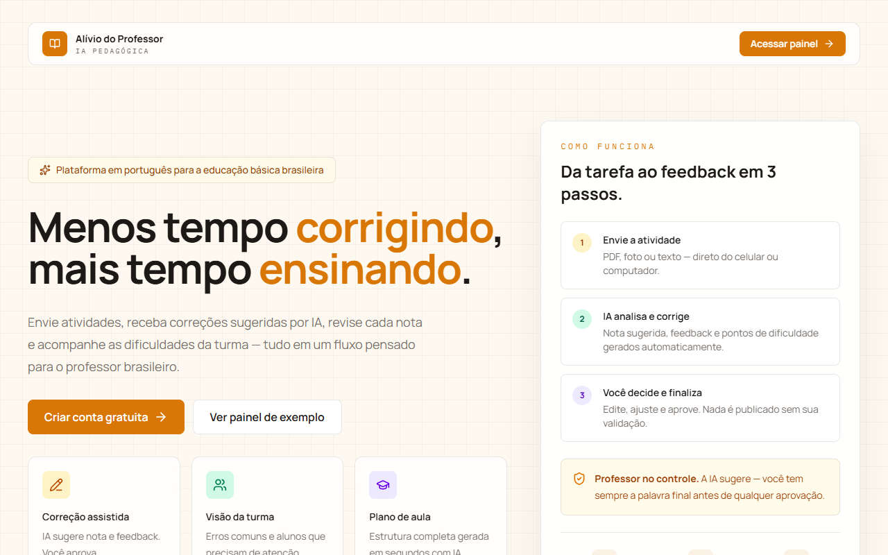
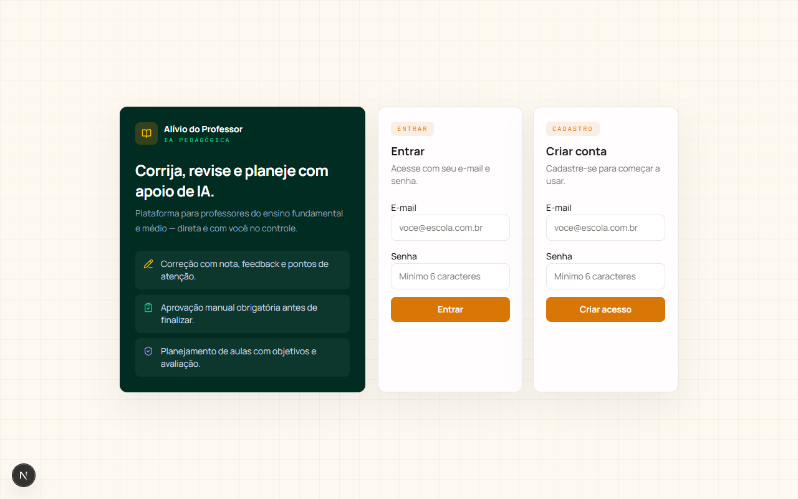
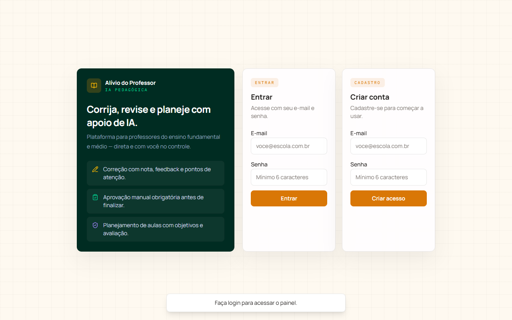
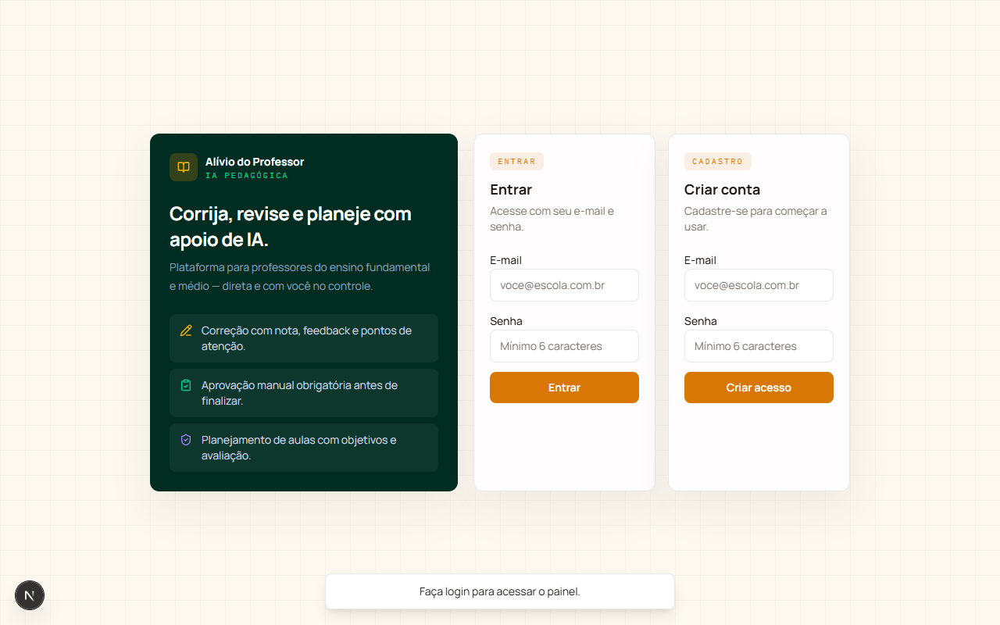
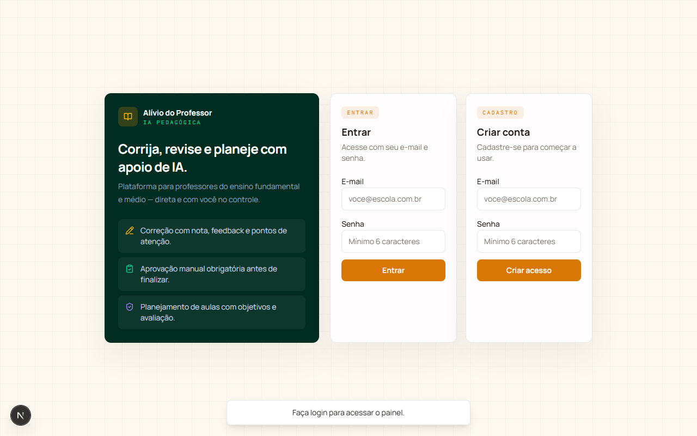
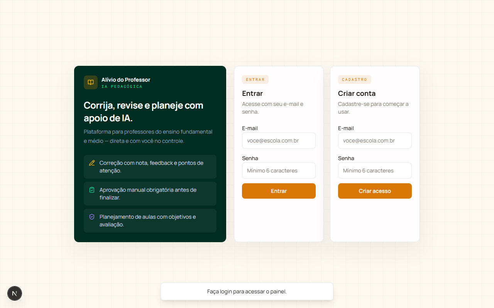
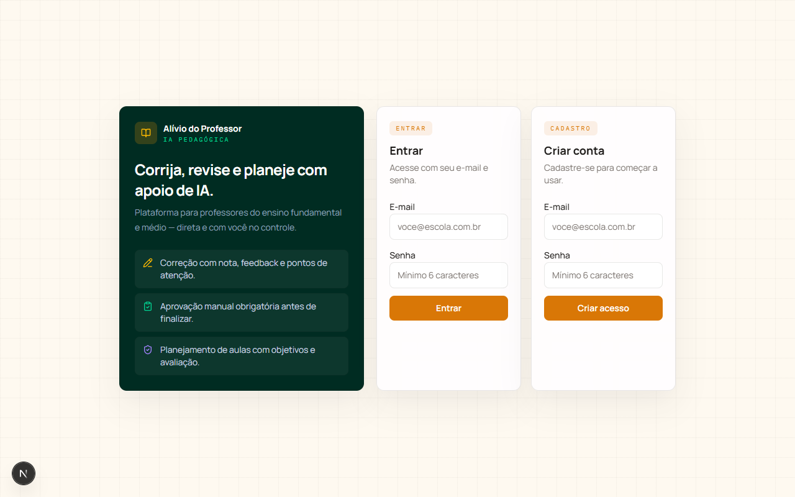

# Alívio do Professor

Plataforma SaaS para professores brasileiros do ensino fundamental e médio que automatiza o ciclo de correção de atividades com IA, mantendo o professor no controle de cada aprovação.

## Funcionalidades

- Upload de atividades em PDF, imagem ou texto
- Correção assistida por IA com nota sugerida, feedback e pontos de atenção
- Revisão manual obrigatória antes de qualquer aprovação
- Planejador de aulas com objetivos, atividades e avaliação gerados por IA
- Relatório consolidado da turma com alunos em dificuldade e erros frequentes
- Lixeira com soft-delete, restauração e exclusão permanente

## Screenshots

| Landing | Login |
|---------|-------|
|  |  |

| Dashboard | Upload |
|-----------|--------|
|  |  |

| Correções | Planejador |
|-----------|------------|
|  |  |

| Lixeira |
|---------|
|  |

## Stack

| Camada | Tecnologia |
|--------|-----------|
| Framework | Next.js 16 (App Router, Webpack) |
| UI | React 19 + Tailwind CSS 4 |
| Banco de dados | Supabase (PostgreSQL 15 + RLS) |
| Autenticação | Supabase Auth (e-mail/senha) |
| Storage | Supabase Storage (bucket privado) |
| IA | Groq — `llama-3.3-70b-versatile` |
| Extração de PDF | pdf-parse v2 |
| Validação | Zod |

## Configuração

### 1. Variáveis de ambiente

Copie o exemplo e preencha:

```bash
cp .env.example .env.local
```

| Variável | Descrição |
|----------|-----------|
| `NEXT_PUBLIC_SUPABASE_URL` | URL do projeto Supabase |
| `NEXT_PUBLIC_SUPABASE_ANON_KEY` | Chave pública do Supabase |
| `SUPABASE_SERVICE_ROLE_KEY` | Chave de serviço (somente servidor) |
| `GROQ_API_KEY` | Chave da API Groq (console.groq.com) |

### 2. Banco de dados

No SQL Editor do Supabase, execute o conteúdo de [`supabase/schema.sql`](supabase/schema.sql). O script é idempotente — pode ser reaplicado sem perda de dados.

### 3. Autenticação

No painel do Supabase: **Authentication → Providers → Email** — desative a confirmação de e-mail para desenvolvimento local.

### 4. Rodar

```bash
npm install
npm run dev
```

Acesse [http://localhost:3000](http://localhost:3000).

## Estrutura do projeto

```
app/
  login/          # Autenticação do professor
  dashboard/      # Painel com resumo e atividade recente
  upload/         # Envio de atividades e processamento em lote
  corrections/    # Revisão manual das correções
  reports/        # Relatório consolidado da turma
  planner/        # Planejador de aulas com IA
  trash/          # Lixeira com restauração e exclusão permanente
  api/            # Route Handlers (assignments, corrections, planner, reports, trash)

components/       # Componentes de UI reutilizáveis
lib/
  ai/             # Integração com Groq (cliente, planner, correction)
  ocr/            # Extração de texto de PDF e imagem
  server/         # Queries server-side (data.ts)
  supabase/       # Clientes Supabase (browser, server, admin, middleware)
supabase/
  schema.sql      # Schema completo com RLS e políticas
  migrations/     # Migrações incrementais
```

## Fluxo principal

```
Upload (PDF/imagem/texto)
  → Extração de texto (pdf-parse)
  → Processamento com IA (Groq)
  → Correção pendente de revisão
  → Professor edita nota e feedback
  → Aprovação ou rejeição manual
  → Relatório consolidado
```

## Segurança

Veja [SECURITY.md](SECURITY.md) para reportar vulnerabilidades e detalhes sobre as práticas adotadas.

## Licença

MIT — veja [LICENSE](LICENSE).
